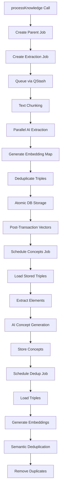

# ProcessKnowledge Pipeline Map

A comprehensive technical documentation of the knowledge processing pipeline in the Knowledge Graph MCP Server.

## Table of Contents
1. [Pipeline Overview](#pipeline-overview)
2. [Entry Point](#entry-point)
3. [Stage 1: Extraction](#stage-1-extraction)
4. [Stage 2: Concept Generation](#stage-2-concept-generation)
5. [Stage 3: Deduplication](#stage-3-deduplication)
6. [Supporting Systems](#supporting-systems)
7. [Data Flow](#data-flow)
8. [Dependencies & Requirements](#dependencies--requirements)
9. [Configuration](#configuration)
10. [Performance Optimizations](#performance-optimizations)

## Pipeline Overview

The `processKnowledge` function implements a **3-job hybrid pipeline** architecture that processes text through three main stages:

```
processKnowledge(text, source, source_type, source_date)
    ↓
[Parent Job] PROCESS_KNOWLEDGE (tracking only)
    ↓
[Child Job 1] EXTRACT_KNOWLEDGE_BATCH (parallel extraction + embeddings + storage)
    ↓ (after extraction completion with smart delays)
[Child Job 2] GENERATE_CONCEPTS (concept generation from stored triples)
    ↓ (conditional, if ENABLE_SEMANTIC_DEDUP=true)
[Child Job 3] DEDUPLICATE_KNOWLEDGE (semantic deduplication)
```

### Key Characteristics
- **Asynchronous Processing**: Uses QStash for background job execution
- **Resource Controlled**: Limited AI calls (4 concurrent) and DB connections (2 concurrent)
- **Atomic Operations**: Database transactions with post-transaction vector generation
- **Smart Scheduling**: Dynamic delays based on extraction metrics
- **Fault Tolerant**: Partial failure handling and retry mechanisms

---

## Entry Point

### Function: `processKnowledge`
**Location**: `src/server/transport-manager.ts:60`

#### Input Parameters
```typescript
interface ProcessKnowledgeArgs {
  text: string;        // Content to process
  source: string;      // Source identifier
  source_type: string; // Type (e.g., "thread", "file", "manual")
  source_date: string; // ISO date string
}
```

#### Process Flow
1. **Validation**: Input parameter validation
2. **Pipeline Initiation**: Calls `initiateKnowledgePipeline(args)`
3. **Status Response**: Returns parent job ID and initial status

#### Output
```typescript
{
  success: true,
  data: {
    message: "Knowledge processing pipeline initiated",
    parentJobId: string,
    estimatedTime: "2-5 minutes",
    stages: {
      extraction: "Coordinated parallel extraction",
      concepts: "Background concept generation", 
      deduplication: "Optional semantic deduplication"
    },
    status: PipelineStatus
  }
}
```

### Pipeline Coordinator: `initiateKnowledgePipeline`
**Location**: `src/features/knowledge-processing/pipeline-coordinator.ts:17`

#### Database Operations
1. **Create Parent Job**:
   ```sql
   INSERT INTO ProcessingJob (job_type='PROCESS_KNOWLEDGE', status='PROCESSING', metadata=...)
   ```

2. **Create Extraction Job**:
   ```sql
   INSERT INTO ProcessingJob (job_type='EXTRACT_KNOWLEDGE_BATCH', parent_job_id=..., stage='EXTRACTION', status='QUEUED')
   ```

3. **Queue Job**: Publishes extraction job to QStash for processing

#### Resource Limits
```typescript
resourceLimits: {
  maxConnections: 2,    // DB connection limit
  maxAICalls: 4,        // Concurrent AI requests  
  maxMemoryMB: 2048     // Memory limit
}
```

---

## Stage 1: Extraction

### Handler: `BatchExtractionJobHandler`
**Location**: `src/features/knowledge-processing/handlers/batch-extraction-handler.ts:18`

#### Process Flow

1. **Text Chunking** (if needed)
   - **Condition**: Text > 3000 tokens (estimated by `text.length / 4`)
   - **Function**: `chunkText()` with 200-token overlap and paragraph preservation
   - **Output**: Array of `TextChunk` objects

2. **Parallel Processing**
   - **Concurrency Control**: Semaphore with `maxAICalls` limit
   - **Progress Tracking**: Updates job progress (10-80% range)
   - **Function**: `processChunksWithResourceLimits()`

3. **Knowledge Extraction**
   - **Method**: Either `single-pass` or `four-stage` (configurable)
   - **Function**: `extractKnowledgeTriples(args)`
   - **AI Provider**: OpenAI/Anthropic with retry mechanism and circuit breaker

4. **Embedding Generation** 
   - **Function**: `generateEmbeddingMap()` - **CRITICAL OPTIMIZATION**
   - **Efficiency**: 70-80% reduction in API calls through deduplication
   - **Scope**: Entities, relationships, semantic content, concepts

5. **Deduplication**
   - **Function**: `deduplicateTriples()` using embedding map
   - **Result**: Reduced triple count through semantic similarity

6. **Atomic Storage**
   - **Function**: `batchStoreKnowledge()`
   - **Transaction**: Atomic storage of triples, concepts, conceptualizations
   - **Post-Transaction**: Vector generation using unified schema

7. **Post-Processing Scheduling**
   - **Function**: `schedulePostProcessingJobs()`
   - **Smart Delays**: Based on extraction metrics

### Knowledge Extraction: `extractKnowledgeTriples`
**Location**: `src/features/knowledge-extraction/extract.ts:185`

#### Extraction Methods

**Single-Pass Extraction**:
- Extracts all relationship types in one AI call
- Faster but potentially less accurate
- Uses `SinglePassTripleSchema` for validation

**Four-Stage Extraction** (Default):
- Parallel extraction of 4 triple types:
  - `ENTITY_ENTITY`: Relationships between entities
  - `ENTITY_EVENT`: Entity involvement in events  
  - `EVENT_EVENT`: Temporal/causal event relationships
  - `EMOTIONAL_CONTEXT`: Emotional states and context
- Uses `extractByType()` for each type concurrently

#### AI Integration
- **Optimization**: Uses `generateText` instead of `generateObject` (40-50% speed improvement)
- **Retry Logic**: `retryAIOperation()` with circuit breaker
- **Token Tracking**: Comprehensive usage metrics
- **Error Handling**: Partial failure recovery with result salvaging

### Embedding Generation: `generateEmbeddingMap`
**Location**: `src/shared/utils/embedding-cache.ts:23`

#### Process
1. **Text Collection**: Gather all unique texts from triples and concepts
   - Entity names (subjects/objects)
   - Relationship names (predicates)
   - Semantic content (full triples)
   - Concept names

2. **Deduplication**: Use `Set` to eliminate duplicates before API calls

3. **Batch Processing**: Process in configurable batch sizes (default: 100)

4. **Efficiency Metrics**:
   ```typescript
   {
     totalTexts: number,        // Before deduplication
     uniqueTexts: number,       // After deduplication  
     duplicatesAverted: number, // Savings achieved
     batchCalls: number         // Total API calls made
   }
   ```

### Batch Storage: `batchStoreKnowledge`
**Location**: `src/shared/database/batch-storage.ts:34`

#### Transaction Operations
1. **Triple Storage**: `KnowledgeTriple` table with duplicate checking
2. **Concept Storage**: `ConceptNode` table  
3. **Conceptualization Storage**: `ConceptualizationRelationship` table

#### Post-Transaction Vector Generation
**Function**: `generateAndStoreVectorsPostTransaction()`
- **Reason**: pgvector compatibility issues within transactions
- **Target**: Unified `VectorEmbedding` table with `vector_type` field
- **Types**: ENTITY, RELATIONSHIP, SEMANTIC vectors
- **Format**: Raw SQL insertion with vector formatting

---

## Stage 2: Concept Generation

### Handler: `ConceptJobHandler` 
**Location**: `src/features/knowledge-processing/handlers/concept-handler.ts:14`

#### Process Flow

1. **Idempotency Check**: Verify concepts don't already exist for source

2. **Triple Loading**: Query stored triples from extraction stage
   ```sql
   SELECT * FROM KnowledgeTriple WHERE source = ? AND source_type = ?
   ```

3. **Element Extraction**: `extractElementsFromTriples()` to get entities/events

4. **AI Concept Generation**: `generateConcepts()` using extracted elements

5. **Storage**: Store concepts and relationships in atomic transaction

#### Concept Generation: `generateConcepts`
**Location**: `src/features/conceptualization/conceptualize.ts`

Creates hierarchical concepts at three abstraction levels:
- **High**: Broad, abstract concepts
- **Medium**: Mid-level categorizations  
- **Low**: Specific, concrete concepts

#### Database Storage
- **Concepts**: `ConceptNode` table with abstraction levels
- **Relationships**: `ConceptualizationRelationship` table linking concepts to source elements

---

## Stage 3: Deduplication

### Handler: `DeduplicationJobHandler`
**Location**: `src/features/knowledge-processing/handlers/deduplication-handler.ts:13`

#### Process Flow

1. **Configuration Check**: Only runs if `ENABLE_SEMANTIC_DEDUP=true`

2. **Triple Loading**: Load all triples for the source

3. **Embedding Generation**: Create embeddings for semantic comparison

4. **Semantic Deduplication**: `deduplicateTriples()` with similarity threshold

5. **Database Cleanup**: Remove duplicate triples and their vectors

#### Deduplication Function: `deduplicateTriples`
**Location**: `src/features/deduplication/deduplicate.js`

Uses semantic similarity to identify and remove duplicate knowledge triples based on configurable threshold (`SEMANTIC_THRESHOLD`, default: 0.85).

---

## Supporting Systems

### Job Processing Architecture

#### Job Router: `routeJob`
**Location**: `src/features/knowledge-processing/job-router.ts:22`

Routes jobs to appropriate handlers:
- `BatchExtractionJobHandler`: EXTRACT_KNOWLEDGE_BATCH, PROCESS_KNOWLEDGE
- `ConceptJobHandler`: GENERATE_CONCEPTS  
- `DeduplicationJobHandler`: DEDUPLICATE_KNOWLEDGE

#### Queue Processing: `handleProcessJob`
**Location**: `src/server/routes/queue.ts:57`

HTTP endpoint handler for QStash job processing:
1. Retrieve job from database
2. Route to appropriate handler
3. Update job status and results

### Vector Storage Architecture

#### Unified Schema: `VectorEmbedding`
Single table with `vector_type` field instead of separate tables:
- **ENTITY**: Entity name vectors
- **RELATIONSHIP**: Predicate vectors  
- **SEMANTIC**: Full triple content vectors
- **CONCEPT**: Concept name vectors

#### Storage Process
1. **In-Transaction**: Store core data (triples, concepts, relationships)
2. **Post-Transaction**: Generate and store vectors via raw SQL

### Resource Management

#### ResourceManager: `ResourceManager`
**Location**: `src/features/knowledge-processing/resource-manager.ts`

Controls resource usage with limits:
- **AI Calls**: Semaphore-based concurrency control
- **Database Connections**: Connection pooling
- **Memory**: Configurable limits per job

---

## Data Flow



### Database Schema Interactions

#### Tables Used
- `ProcessingJob`: Job tracking and status
- `KnowledgeTriple`: Extracted knowledge relationships  
- `ConceptNode`: Generated concepts
- `ConceptualizationRelationship`: Element-to-concept mappings
- `VectorEmbedding`: Unified vector storage

#### Transaction Boundaries
1. **Job Creation**: Parent + child job creation
2. **Knowledge Storage**: Triples + concepts + relationships  
3. **Vector Generation**: Separate post-transaction operation
4. **Concept Storage**: Concepts + relationships
5. **Deduplication**: Triple and vector deletion

---

## Dependencies & Requirements

### Core Dependencies
- **Database**: PostgreSQL with pgvector extension
- **AI Providers**: OpenAI or Anthropic APIs
- **Queue**: QStash for background processing  
- **ORM**: Prisma for database operations

### Required Services
- **Embedding Service**: Text-to-vector conversion
- **AI Provider Service**: Text generation and processing
- **Database Client**: PostgreSQL connection
- **Queue Service**: Asynchronous job processing

### External APIs
- **OpenAI**: GPT models for extraction, embedding models for vectors
- **Anthropic**: Claude models for extraction (alternative)
- **QStash**: Job queue management and scheduling

### Infrastructure Requirements  
- **Vector Indexes**: pgvector indexes for similarity search
- **Connection Pooling**: Database connection management
- **Memory**: Sufficient for batch processing and embeddings

---

## Configuration

### Environment Variables

#### Core Settings
```bash
# AI Provider Configuration
AI_PROVIDER=openai|anthropic
AI_MODEL=gpt-4o-mini  
EMBEDDING_MODEL=text-embedding-3-small
EMBEDDING_DIMENSIONS=1536

# Processing Configuration  
EXTRACTION_METHOD=single-pass|four-stage
EXTRACTION_TEMPERATURE=0.1
MAX_CHUNK_TOKENS=1500
BATCH_SIZE=100

# Performance Settings
SEARCH_TOP_K=10
MIN_SCORE=0.7
ENABLE_SEMANTIC_DEDUP=false
SEMANTIC_THRESHOLD=0.85

# Infrastructure
DATABASE_URL=postgresql://...
HTTP_SERVER_URL=https://...
OPENAI_API_KEY=sk-...
ANTHROPIC_API_KEY=...
```

#### Transport Settings
```bash
ENABLE_STDIO_TRANSPORT=true
ENABLE_HTTP_TRANSPORT=false
HTTP_PORT=3000
HTTP_BASE_PATH=/api
```

### Feature Flags
- `ENABLE_SEMANTIC_DEDUP`: Enable/disable semantic deduplication stage
- `EXTRACTION_METHOD`: Choose between single-pass or four-stage extraction
- Transport enables: Control which MCP transports are active

---

## Performance Optimizations

### Key Optimizations Implemented

1. **Embedding Map Generation** (70-80% API cost reduction)
   - Single comprehensive embedding generation
   - Deduplication before API calls
   - Reuse across all vector operations

2. **Parallel Processing**  
   - Four-stage extraction runs concurrently
   - Controlled concurrency with semaphores
   - Resource-aware scheduling

3. **Text Generation Optimization** (40-50% speed improvement)
   - Use `generateText` instead of `generateObject`
   - Custom JSON parsing and validation
   - Reduced AI processing overhead

4. **Batch Processing**
   - Configurable batch sizes for embeddings
   - Atomic database transactions
   - Bulk operations where possible

5. **Smart Job Scheduling**
   - Dynamic delays based on extraction metrics
   - Resource-aware job routing
   - Circuit breaker for AI operations

6. **Database Optimizations**
   - Unified vector schema
   - Post-transaction vector generation
   - Connection pooling and limits

### Performance Metrics
- **Extraction Time**: 2-5 minutes for typical documents
- **API Efficiency**: 70-80% reduction in embedding API calls
- **Concurrency**: Up to 4 parallel AI calls, 2 DB connections
- **Memory**: Configurable limits per job (default: 2GB)

### Monitoring Points
- Job progress tracking (0-100%)
- Resource utilization metrics
- API usage and costs
- Error rates and retry statistics
- Processing time distributions

---

## Error Handling & Fault Tolerance

### Retry Mechanisms
- **AI Operations**: Circuit breaker with retry logic
- **Database Operations**: Transaction rollback and retry
- **Queue Processing**: Configurable max retries per job

### Partial Failure Recovery
- **Chunk Processing**: Continue with successful chunks if some fail
- **Extraction Stages**: Salvage partial results from failed validations
- **Vector Generation**: Continue processing even if some embeddings fail

### Progress Tracking
- Real-time job progress updates (10% increments)
- Stage-based status reporting
- Error logging with context and state information

---

This document provides a complete technical map of the `processKnowledge` pipeline, showing all inputs, outputs, dependencies, and data transformations throughout the knowledge processing workflow.